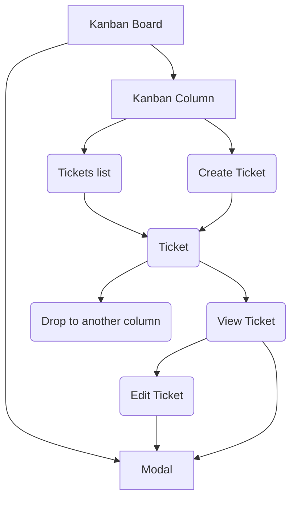

- [Kanban Tickets](#kanban-tickets)
  - [Specifications](#specifications)
    - [Tasks](#tasks)
  - [Code Linting](#code-linting)
  - [Start the app](#start-the-app)
  - [API Schema](#api-schema)
  - [Packages Used](#packages-used)
    - [Axios](#axios)
    - [React](#react)
    - [React Router](#react-router)
    - [React Edit Text](#react-edit-text)
    - [Tailwind CSS](#tailwind-css)
    - [React DND](#react-dnd)
  - [Theme](#theme)
    - [Dark Theme](#dark-theme)
    - [Styling Approach](#styling-approach)
  - [Kanban Flow Diagram](#kanban-flow-diagram)
  - [Testing](#testing)
    - [Performance, Accessibility, SEO](#performance-accessibility-seo)
    - [Testing HTTP Requests](#testing-http-requests)
    - [Unit Testing](#unit-testing)
  - [Issues](#issues)
    - [Known Issues](#known-issues)
    - [Fixed Issues](#fixed-issues)
  - [Future Updates](#future-updates)
  - [Resources](#resources)
    - [Edit Input and Textarea](#edit-input-and-textarea)
    - [Draggable Tickets](#draggable-tickets)
    - [Modal](#modal)
    - [Router](#router)
    - [Tailwind CSS](#tailwind-css-1)
    - [Setting Up the project (Vite, React, TypeScript, Vitest, Testing-Library, Eslint, Prettier)](#setting-up-the-project-vite-react-typescript-vitest-testing-library-eslint-prettier)
    - [Vitest, React Testing Library](#vitest-react-testing-library)

# Kanban Tickets

## Specifications

Create a minimal Kanban board on which you can create, view and move tickets between columns.

### Tasks

- be able to create tickets on the board.
- be able to move tickets between the various columns in an interactive way, persisting across page refreshes.
- be able to share a direct link to the ticket.

For more read the [specifications](https://github.com/madewithlove/technical-assignment-front-end-engineer-TheoKondak/blob/main/docs/specifications.md) document.

## Code Linting

For linting this project adopts the [Airbnb JavaScript Style Guide](https://github.com/airbnb/javascript).

## Start the app

To start the app, you will need Node.js and npm or yarn. 

- Make Sure `Node.js` and `npm` are installed. Open a terminal and type `node -v` to see the version of Node.js. If you get an error or your version is older than 16.0.0, you need to download the [latest version](https://nodejs.org/en/download/).
- Open a terminal in the root directory of the project, and install the npm packages required by running `npm install`.
- The application has a front end as well as a mock [JSON-server](https://www.npmjs.com/package/json-server) to act as a temporary backend endpoint for the data. We need both running at the same time to be able to view the app.

| Operation | Command |
|---|---|
| Start JSON-server | `npm run server` |
| Start React App | `npm run dev` |

> NOTE: By default, `JSON-server` runs on port 3000. Sometimes the port is not available which might cause the server to run on another port. In that case, create a `.env` file and add: `VITE_SERVER_URL='http://localhost:XXXX'`, where `XXXX` place the port that is mentioned in the terminal. Make sure you restart vite server after any change to `.env` file so that the changes take effect.

## API Schema

Below is a short version of the API schema. You can also view the full schema [here](https://github.com/madewithlove/technical-assignment-front-end-engineer-TheoKondak/blob/main/docs/API_SCHEMA.json).

```
- Kanban: Array
  - settings: Object
    - kanban: Object
      - logo: Object
        - src: String
        - width: String
        - height: String
        - alt: String
      - footer: Object
        - copyrightInfo: String
        - githubLink: String
        - githubLinkOpensInNewTab: Boolean
    - tickets: Object
      - ticketPreviewLength: String
  - columns: Array
    - id : Number
    - title: String
  - tickets: Array
    - id: Number
    - columnId: Number
    - title: String
    - content: String

```

## Packages Used

This project has several dependencies. To find an exhaustive list please check `package.json`: `dependencies`, and `devDependencies`.

### Axios

Axios is the industry standard when it comes to HTTP requests. There are alternative methods of querying data, like [React Query](https://react-query-v3.tanstack.com/), but the project is simple at this stage, so there is no need for it.

### React

React, is considered the golden standard for developing web applications. It's well tested, well maintained with a huge ecosystem of other libraries that work out of the box with it. To create the app, I used Vite instead of CRA for [several reasons](https://vitejs.dev/guide/why.html).

### React Router

For handling routes, [React Router](https://reactrouter.com/en/main) was selected, because it is the industry standard. Unfortunately, the library often has a lot of breaking changes, which makes it a bit harder to use and to update in the future for a range of reasons. For this application, I used the latest version, `"react-router": "^6.8.2",`

### React Edit Text

Input handling is being managed by [React Edit Text](https://github.com/bymi15/react-edit-text) which is pretty straightforward to use even though it is not so popular. That being said, there were issues during development, which lead to some non best practices being followed namely for styling the components. 

### Tailwind CSS

[Tailwind CSS](https://tailwindcss.com/docs/installation) provides a quick and safe way to create a stylized template. The documentation is stellar, and the framework is well tested and used in production by many large companies. It also allows for a quick Dark theme mode, a feature which is utilized in this project. See [Theme section](https://github.com/madewithlove/technical-assignment-front-end-engineer-TheoKondak#theme) for more.

### React DND

For implementing the Drag and Drop functionality I used [React DND](https://github.com/react-dnd/react-dnd/), mostly because it is more up-to-date, and better maintained than its alternatives like [React-Beautiful-Dnd](https://github.com/atlassian/react-beautiful-dnd).

[React DND](https://github.com/react-dnd/react-dnd/) is the most modern and up to date. It has a lot of

## Theme

The Kanban interface is pretty minimal when it comes to design. Color wise, Tailwind color gamuts are used to create a theme (view the [tailwind config](https://github.com/madewithlove/technical-assignment-front-end-engineer-TheoKondak/blob/main/tailwind.config.cjs) file). The current approach is based on the Monochromatic design principles, since a Kanban dashboard is a professional tool that needs to be minimal, without complicated design patterns that will become tiresome to the user after a while.

The color palette can be easily changed by changing the `primary` color. See more available colors [here](https://tailwindcss.com/docs/customizing-colors).

```TSX
const colors = require('tailwindcss/colors');

/** @type {import('tailwindcss').Config} */
module.exports = {
  darkMode: 'class',
  theme: {
    extend: {
        colors: {
                primary: colors.slate,
                companyColor: '#ff6224',
        }
    }
  }
}

```

### Dark Theme

By default a high-key color palette is chosen. That means mostly bright colors. Dark themes are very popular though, and a lot of users find them more attractive. This kanban dashboard supports dark theme. To enable it click on the top right corner icon.

### Styling Approach

The styling of the application has been done with Tailwind CSS, mostly written in the Component `tsx` files. In some cases, that was not possible, and thus the styling for these components can be found in `App.css`. 

## Kanban Flow Diagram

> NOTE: Some diagrams are using [Mermaid Syntax](https://mermaid.js.org/). Github supports it by default. If you are viewing this file on VSCode there are plugins (ex [Markdown Preview Mermaid Support](https://marketplace.visualstudio.com/items?itemName=bierner.markdown-mermaid)) that will be able to read and display the diagrams. 



## Testing

### Performance, Accessibility, SEO

At the moment, there is no build version of the application - still some TSX issues to be fixed -, thus the **Performance** tests of the Google Lighthouse are irrelevant.

**Accessibility** testing yelds an 100% score, so no further improvements to be made.

Since this is an internal application, SEO is irrelevant, thus no special attention has been paid to it. That being said, some static meta description has been added, as well as relevant HTML attributes to HTML elements where required (also to improve accessibility).

You can view the results of the Google Lighthouse tests [here](https://github.com/madewithlove/technical-assignment-front-end-engineer-TheoKondak/tree/main/tests/lighthouse%20reports).

### Testing HTTP Requests

For testing HTTP Requests I am using [REST Client](https://marketplace.visualstudio.com/items?itemName=humao.rest-client), a VSCode plugin. REST Client performs quick HTTP requests in a local environment. It's fast and easy to set up.

To run the tests open `requests/kanban.rest` and press **Send Request**

### Unit Testing

[Vitest](https://vitest.dev/) is a new testing suite that has a different approach, and is a lot faster, runs out of the box, and shares configuration with Vite. There are several other reasons why Vitest is the better solution. [Read more](https://vitest.dev/guide/why.html) 

At the moment there are several tests both for components and functions. Even though several aspects of the applications are checked, more tests need to be written, to cover a wider area of cases, as well as to cover 100% of the components. 

To run the tests run `npm run test` in the root directory of the project.

As of now, this is a coverage report:

```
 ✓ src/helper/handleInputChange.test.ts (1)     
 ✓ src/helper/copyTextToClipboard.test.ts (2)   
 ✓ src/helper/generateId.test.ts (3)
 ✓ src/services/kanbanService.test.ts (6)       
 ✓ src/components/Button.test.tsx (3)
 ✓ src/components/AddTicket.test.tsx (5)        
 ✓ src/components/modal/TicketModal.test.tsx (3)
 ✓ src/components/Ticket.test.tsx (5)
 ✓ src/components/Column.test.tsx (2)
 ✓ src/App.test.tsx (2)

 Test Files  10 passed (10)
      Tests  32 passed (32)
   Start at  16:53:14
   Duration  4.16s (transform 2.36s, setup 4.02s, collect 5.92s, tests 500ms)

 #### % Coverage report from c8
```

| File | % Stmts | % Branch | % Funcs | % Lines | Uncovered Line #s|
|---|---|---|---|---|---|
|All files | 67.7 | 77.55 | 42.22 | 67.7 | |
| src | 76.47 | 66.66 | 33.33 | 76.47 | |
| App.tsx | 76.47 | 66.66 | 33.33 | 76.47 | 27,30,36,52-53,57-58,63-75|
| src/components | 72.56 | 86.95 | 47.82 | 72.56 | |
| AddTicket.tsx | 72.72 | 85.71 | 44.44 | 72.72 | 18-34,45-47,49-50,52-53 |
| Button.tsx | 100 | 100 | 100 | 100 | |
| Column.tsx | 94.59 | 66.66 | 66.66 | 94.59 | 16-17|
| Footer.tsx | 42.3 | 100 | 0 | 42.3 | 10-24|
| Header.tsx | 47.82 | 100 | 0 | 47.82 | 10-21|
| Loading.tsx | 100 | 100 | 100 | 100 | |
| Logo.tsx | 29.41 | 100 | 0 | 29.41 | 4-15|
| Ticket.tsx | 83.33 | 100 | 50 | 83.33 | 13-17,23-25|
| Tickets.tsx | 88.46 | 100 | 50 | 88.46 | 6-8|
| src/components/modal | 73.27 | 42.85 | 20 | 73.27 | |
| BaseModalWrapper.tsx | 45.45 | 100 | 0 | 45.45 | 4-9|
| TicketModal.tsx | 76.19 | 42.85 | 22.22 | 76.19 | 37-57,64-65,85-86|
| src/helper | 68.18 | 100 | 40 | 68.18 | |
| copyTextToClipboard.ts | 100 | 100 | 100 | 100 | |
| detectTouch.ts | 100 | 100 | 0 | 100 | |
| generateId.ts | 100 | 100 | 100 | 100 | |
| handleInputChange.ts | 57.14 | 100 | 0 | 57.14 | 3-5|
| toggleDarkMode.ts | 42.85 | 100 | 0 | 42.85 | 2-5|
| src/routes | 41.07 | 100 | 0 | 41.07 | |
| root.tsx | 41.07 | 100 | 0 | 41.07 | 22-54|
| src/services | 52.94 | 77.77 | 100 | 52.94 | |
| kanbanService.ts | 52.94 | 77.77 | 100 | 52.94 | 10-25,43-50,62-77|

To generate a coverage report `npm run coverage` in the root directory of the project.

## Issues

### Known Issues

- Typescript is only partially implemented, some interfaces need to be updated. So `npm run build` ing the project is not possible at the moment.
- Some components, like `Button` are not used everywhere, make them reusable, and introduce a unified button style.
- Columns are draggable, but not droppable while they shouldn't be draggable.

### Fixed Issues

- When someone tries to visit a non-existing Ticket (ex `http://127.0.0.1:5173/ticket/someWrongURL`), then some errors occur in the console. This is due to React Router route handling.
- When someone visits a ticket by typing the URL, then the Modal does not pop up. It is being inserted into the DOM, but it does not display.
- When the page refreshes, the columns reset (I am not sending PUT to the backend)
- When a ticket is updated, the interface does not rerender
- Drag and drop is working only on desktop devices (no touch support)
- Several design issues in all screen sizes.
- Modal in desktop resolutions renders off-center.

## Future Updates

This app has some bare-bones capabilities, based on the [requested specifications](https://github.com/madewithlove/technical-assignment-front-end-engineer-TheoKondak#technical-assignment-front-end-engineer). That means that it lacks basic functionality, such as deleting a ticket.

- Add Delete Ticket functionality
- Add user authentication
- Request data from the server in some interval or on some action (create, edit Ticket).
- To be able to rearrange the order of the tickets in a column
- Add a state management tool like Redux
- Depending on the audience of the application, improve Accessibility & SEO
- Add theme capabilities
- Remove `react-edit-text` because it provides limited support in some cases, like styling, and sometimes has problematic interactivity.
- Add support for Markdown for the `content` field.
- Add support for multiple languages by replacing static strings, to retrieve language data from the database.
- For touch screen devices, add a *long press to move* action when holding touch over a `Ticket`, to move to another column. This will help with smartphone screen size limitations. ([see more on how to do](https://stackoverflow.com/questions/48048957/react-long-press-event)).
- Integrate more thorough unit testing. Currently the testing implementing is on a very basic level.
- Implement end-to-end with Playwright
- Document the project with Storybooks. Storybooks can be a one-stop solution for all testing. It can facilitate interface for the unit testing with [Vitest](https://storybook.js.org/addons/storybook_vitest_addon/), as well as for [Playwright](https://storybook.js.org/addons/storybook-addon-playwright). Furthermore, using [`mdx`](https://storybook.js.org/docs/react/writing-docs/mdx) we can document the usage of each component even further.

## Resources

### Edit Input and Textarea

- https://brianmin.com/react-edit-text/
- https://www.npmjs.com/package/react-edit-text

### Draggable Tickets

- https://react-dnd.github.io/react-dnd/about

### Modal

- https://biagio.dev/posts/tailwindcss-react-modal

### Router

- https://reactrouter.com/en/main/start/faq#why-does-route-have-an-element-prop-instead-of-render-or-component
- https://reactrouter.com/en/main/start/tutorial
- https://github.com/remix-run/react-router/tree/dev/examples/modal

### Tailwind CSS

- https://tailwindcss.com/docs/customizing-colors
- https://tailwindcss.com/docs/installation

### Setting Up the project (Vite, React, TypeScript, Vitest, Testing-Library, Eslint, Prettier)

- https://www.youtube.com/watch?v=cchqeWY0Nak&ab_channel=CodingGarden
- Vite & Vitest configuration file: https://github.com/vitest-dev/vitest/blob/main/examples/react-testing-lib-msw/vite.config.ts
- https://markus.oberlehner.net/blog/using-testing-library-jest-dom-with-vitest/

### Vitest, React Testing Library

- https://vitest.dev/api/
- https://testing-library.com/docs
- https://vitest.dev/guide/mocking.html
- https://stackoverflow.com/questions/74930606/mock-react-router-dom-useparams-hook-in-vitest
