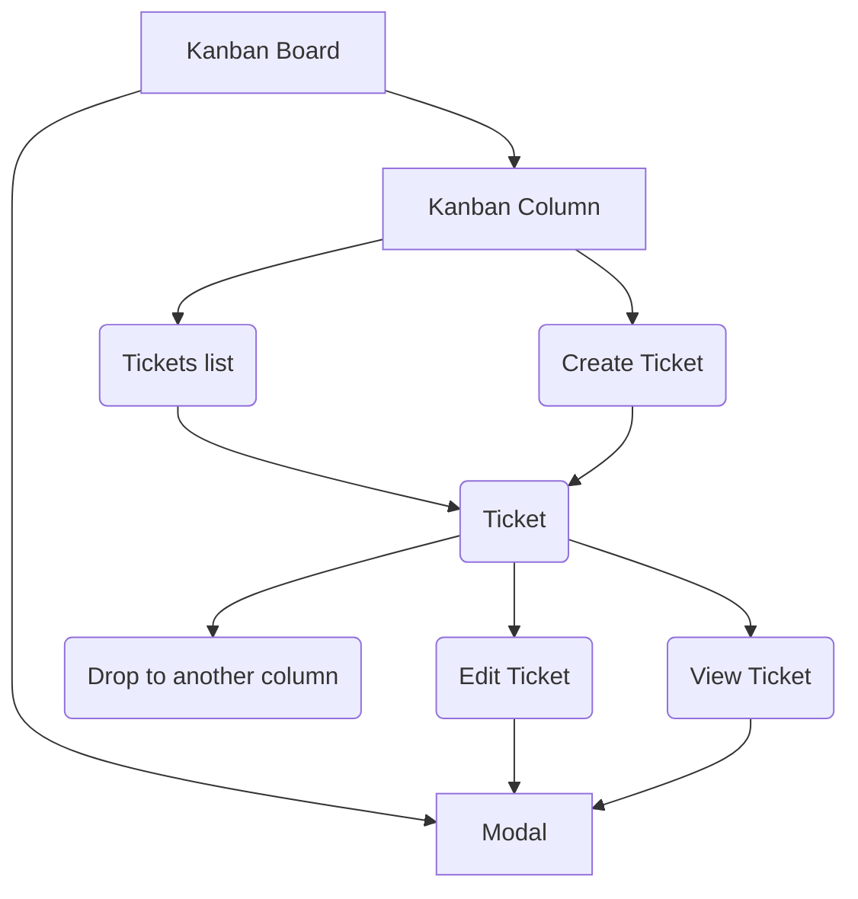

- [Kanban Tickets](#kanban-tickets)
  - [Start the app](#start-the-app)
  - [API Schema](#api-schema)
  - [Packages Used](#packages-used)
    - [Axios](#axios)
    - [React](#react)
    - [React Router](#react-router)
    - [React Edit Text](#react-edit-text)
    - [Tailwind CSS](#tailwind-css)
    - [React DND](#react-dnd)
  - [Kanban State Diagram](#kanban-state-diagram)
  - [Testing](#testing)
    - [Test HTTP Requests with Rest Client](#test-http-requests-with-rest-client)
  - [Known Issues](#known-issues)
  - [Future Updates](#future-updates)
  - [Sources](#sources)
    - [Edit Input and Textarea](#edit-input-and-textarea)
    - [Draggable Tickets](#draggable-tickets)
    - [Modal](#modal)
    - [Router](#router)


# Kanban Tickets

## Start the app

To start the app, you will need Node.js and npm or yarn. 

- Make Sure `Node.js` and `npm` are installed. Open a terminal and type `node -v` to see the version of Node.js. If you get an error or your version is older than 16.0.0, you need to download the [latest version](https://nodejs.org/en/download/).
- Open a terminal in the root directory of the project, and install the npm packages required by running `npm install`.
- The application has a front end as well as a mock JSON-server to act as a temporary backend endpoint for the data. We need both running at the same time to be able to view the app.

| Operation | Command |
|---|---|
| Start JSON-server | `npm run server` |
| Start React App | `npm run dev` |

## API Schema

```
- Kanban: Array
  - Columns: Array
    - id : Number
    - title: String
  - Tickets: Array
    - id: Number
    - columnId: Number
    - title: String
    - content: String

```

## Packages Used

This project has several dependencies. To find an exhaustive list please check `package.json, `dependencies`, and `devDependencies`.

### Axios

Axios is the industry standard when it comes to HTTP requests. There are alternative methods of querying data, like [React Query](https://react-query-v3.tanstack.com/), but the project is simple at this stage, so there is no need for it.

### React

React, is considered the golden standard for developing web applications. It's well tested, well maintained with a huge ecosystem of other libraries that work out of the box with it. To create the app, I used Vite instead of CRA for [several reasons](https://vitejs.dev/guide/why.html).

### React Router

For handling routes, I chose React Router, again because it is the industry standard. Unfortunately, the library often has a lot of breaking changes, which makes it a bit harder to use and to update in the future for a range of reasons. For this application, I used the latest version, `"react-router": "^6.8.2",`

### React Edit Text

For handling textfields I used [React Edit Text](https://github.com/bymi15/react-edit-text) which is pretty straightforward to use even though it is not so popular. 

### Tailwind CSS

For designing the interface, I used [Tailwind CSS](https://tailwindcss.com/docs/installation), which is one of the preferred methods in the industry, along [Styled Components](https://styled-components.com/).

### React DND

For implementing the Drag and Drop functionality I used [React DND](https://github.com/react-dnd/react-dnd/), mostly because it is more up-to-date, and better maintained than its alternatives like [React-Beautiful-Dnd](https://github.com/atlassian/react-beautiful-dnd).

## Kanban State Diagram

> NOTE: Some diagrams are using [Mermaid Syntax](https://mermaid.js.org/). Github supports it by default. If you are viewing this file on VSCode there are plugins (ex [Markdown Preview Mermaid Support](https://marketplace.visualstudio.com/items?itemName=bierner.markdown-mermaid)) that will be able to read and display the diagrams. 



## Testing

TODO

### Test HTTP Requests with Rest Client

For testing HTTP Requests I am using [REST Client](https://marketplace.visualstudio.com/items?itemName=humao.rest-client), a VSCode plugin. REST Client performs quick HTTP requests in a local environment. It's fast and easy to set up.

To run the tests open  `requests/kanban.rest` and press **Send Request**


## Known Issues

- Typescript is only partially implemented, some interfaces need to be updated.
- When someone tries to visit a non-existing Ticket (ex `http://127.0.0.1:5173/ticket/someWrongURL`), then some errors occur in the console. This is due to React Router route handling.
- When someone visits a ticket by typing the URL, then the Modal does not pop up. It is being inserted into the DOM, but it does not display.
- Several design issues in all screen sizes.

## Future Updates

TODO 

This app has some bare-bones capabilities, based on the [requested specifications](https://github.com/madewithlove/technical-assignment-front-end-engineer-TheoKondak#technical-assignment-front-end-engineer). That means that it lacks basic functionality, such as deleting a ticket.

- Add Delete Ticket functionality
- Request data from the server in some interval or on some action (create, edit Ticket).
- To be able to rearrange the order of the tickets in a column
- Add a state management tool like Redux
- Document components with Storybooks
- Test components with Playwright

## Sources

### Edit Input and Textarea

- https://brianmin.com/react-edit-text/
- https://www.npmjs.com/package/react-edit-text

### Draggable Tickets

- https://react-dnd.github.io/react-dnd/about

### Modal

- https://biagio.dev/posts/tailwindcss-react-modal

### Router

- https://reactrouter.com/en/main/start/faq#why-does-route-have-an-element-prop-instead-of-render-or-component
- https://reactrouter.com/en/main/start/tutorial
- https://github.com/remix-run/react-router/tree/dev/examples/modal

